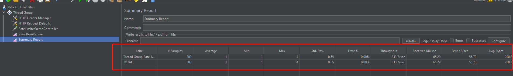

# 概述

限流复杂度可大可小，与公司的架构设计有关，是单体架构还是微服务架构。以及如何把限流这一个通用的逻辑处理进行组件化设计。使其引入到公司项目中开箱即用。


# 工作事项

| 序号 | 工作事项                                                     | 进度 | 计划开始时间 | 计划结束时间 | 实际开始时间 | 实际结束时间 | 备注 |
| ---- | ------------------------------------------------------------ | ---- | ------------ | ------------ | ------------ | ------------ | ---- |
| 1    | 完成rate-limiter-demo springboot 项目框架搭建                | done |              |              |              |              |      |
| 2    | rate-limiter-demo-1.0 单体架构下的方案设计。                 | done |              |              |              |              |      |
| 3    | rate-limiter-demo-1.0 单体架构下的代码编写                   | done |              |              |              |              |      |
| 4    | rate-limiter-demo-1.0 的性能测试以及jmeter脚本编写           | done |              |              |              |              |      |
| 5    | 集成logback到rate-limiter-demo-1.0                           | done |              |              |              |              |      |
| 6    | 集成swagger到rate-limiter-demo-1.0以及解决springboot3不支持springfox的问题。本机访问swagger请[点击](http://localhost:8090/ratelimiter/swagger-ui/index.html) | done |              |              |              |              |      |
| 7    | docker相关事宜包括Dockerfile文件编写，构建rate-limiter-demo-1.0镜像，以及推动到dockerhub中。下载该docker镜像请访问[该网址](https://hub.docker.com/r/qinlinsendocker/rate-limiter-demo) | done |              |              |              |              |      |
| 8    | 分布式架构下限流组件化的方案设计。写一个spring-starter 做到开箱即用 | todo |              |              |              |              |      |
| 9    | 分布式架构下限流的代码实现                                   | todo |              |              |              |              |      |
| 10   | 分布式架构下限流的测试                                       | todo |              |              |              |              |      |

#  单体架构下的方案设计

整体架构图如下所示


说明： 以springboot中的aop和guava中的限流组件作为技术支撑层完成单体架构下限流的核心代码。

自定义限流注解。应用层代码只需加上RateLimit注解，就可以实现限流。并且该demo中构建了该限流demo的docker镜像并上传至docker hub中


# 限流的性能测试

1秒钟有300个请求过来，现在允许的有3个。性能测试报告如下图所示：




jemeter脚本的位置在： src/main/resources/doc/Rate limit Test Plan.jmx

# 推送到dockerhub

```shell
 #构建docker 镜像
 docker build -t rate-limiter-demo:1.0 .
 
 #查看docker 镜像
 docker images
 
 #推送docker镜像到dockerhub中
  docker tag a5195494225e qinlinsendocker/rate-limiter-demo:1.0
  docker push qinlinsendocker/rate-limiter-demo:1.0

```

# 从dockerhub中下载rate-limit-demo

```shell
docker pull qinlinsendocker/rate-limiter-demo:1.0
```


# 重要的访问地址

[qinlinsen dockerhub](https://hub.docker.com/r/qinlinsendocker/rate-limiter-demo)

[swagger](http://localhost:8090/ratelimiter/swagger-ui/index.html)

